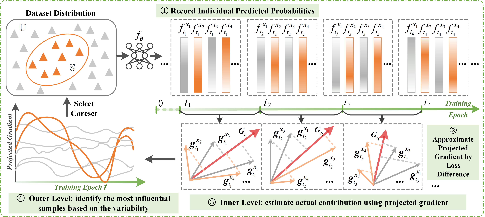

# 📍 Dataset-Pruning-TDDS 

Official PyTorch implementation of paper **(CVPR 2024)** 🤩
>["Spanning Training Progress: Temporal Dual-Depth Scoring (TDDS) for Enhanced Dataset Pruning"](https://arxiv.org/abs/2311.13613)<br>
>[Xin Zhang](https://scholar.google.com/citations?view_op=list_works&hl=zh-CN&user=rJMMViQAAAAJ), [Jiawei Du](https://scholar.google.com/citations?user=WrJKEzEAAAAJ&hl=zh-CN), [Yunsong Li](https://ieeexplore.ieee.org/author/37292407800), [Weiying Xie](https://scholar.google.com/citations?user=y0ha5lMAAAAJ&hl=zh-CN), [Joey Tianyi Zhou](https://joeyzhouty.github.io/) <br>
>XDU, A*Star

<div align=center>

</div>

## 📝 Abstract

Dataset pruning aims to construct a coreset capable of achieving performance comparable to the original, full dataset. Most existing dataset pruning methods rely on snapshot-based criteria to identify representative samples, often resulting in poor generalization across various pruning and cross-architecture scenarios. Recent studies have addressed this issue by expanding the scope of training dynamics considered, including factors such as forgetting event and probability change, typically using an averaging approach. However, these works struggle to integrate a broader range of training dynamics without overlooking well-generalized samples, which may not be sufficiently highlighted in an averaging manner. In this study, we propose a novel dataset pruning method termed as \textbf{Temporal Dual-Depth Scoring (TDDS)}, to tackle this problem. TDDS utilizes a dual-depth strategy to achieve a balance between incorporating extensive training dynamics and identifying representative samples for dataset pruning. In the first depth, we estimate the series of each sample's individual contributions spanning the training progress, ensuring comprehensive integration of training dynamics. In the second depth, we focus on the variability of the sample-wise contributions identified in the first depth to highlight well-generalized samples. Extensive experiments conducted on CIFAR and ImageNet datasets verify the superiority of TDDS over previous SOTA methods. Specifically on CIFAR-100, our method achieves 54.51\% accuracy with only 10\% training data, surpassing random selection by 7.83\% and other comparison methods by at least 12.69\%.

## 👩🏻‍💻 Usage and Examples
Use following steps you can reproduce baselines and TDDS on CIFAR10 and CIFAR100. Here we use CIFAR100 as an example, the detailed training setting can be found in our paper.
### Environment 🌏
We conduct our experiments on 3090 GPUs in an environment configured as follows:
- Python version: 3.9.18
- PyTorch version: 2.2.1+cu121
- cuDNN version: 8902

Readers do not need to replicate our setup exactly.
### Train Classifiers on the Entire Dataset 🏃🏻‍♀️
This step is necessary to collect the training dynamics for subsequential coreset selection.

```python
python train.py --data_path ./data --dataset cifar100 --arch resnet18 --epochs 200 --learning_rate 0.1 --batch-size 100 --dynamics --save_path ./checkpoint/all-dataset
```

After completing training, you will obtain three `.npy` files for each epoch under the path `./checkpoint/all-dataset`.

### Sample Importance Evaluation
```python
python importance_evaluation.py --dynamics_path ./checkpoint/all-dataset/npy/ --mask_path ./checkpoint/generated_mask/ --trajectory_len 30 --window_size 10 --decay 0.9
```

After the computation, you will obtain two `.npy` files storing sorted sample indexes and their respective importance scores.
### Train Classifiers on the Pruned Dataset
```python
python train_subset.py --data_path ./data --dataset cifar100 --arch resnet18 --epochs 200 --learning_rate 0.1 --batch-size 120 --dynamics --save_path ./checkpoint/pruned-dataset --subset_rate 0.9 --mask_path ./checkpoint/generated_mask/data_mask_winxx_epxx.npy --score_path ./checkpoint/generated_mask/score_winxx_epxx.npy
```
*For an aggressive pruning rate, setting a smaller batch size will lead to better performance.

For the implementation of ImageNet-1K dataset please refer [timm](https://github.com/huggingface/pytorch-image-models).

If you have any questions, please feel free to connect with me! 🤗
## 🙋🏻‍♀️ Citation

If you find our code useful for your research, please cite our paper. 🤭

```
@inproceedings{zhang2024TDDS,
  title={Spanning Training Progress: Temporal Dual-Depth Scoring (TDDS) for Enhanced Dataset Pruning},
  author={Xin, Zhang and Jiawei, Du and Yunsong, Li and Weiying, Xie and Joey Tianyi Zhou},
  booktitle={IEEE Conf. Comput. Vis. Pattern Recog.},
  year={2024},
}
```
